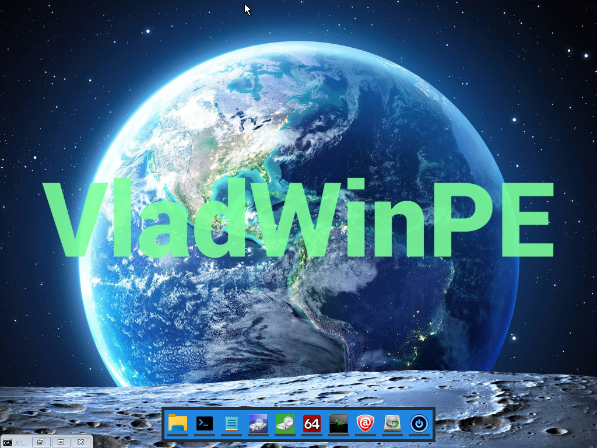
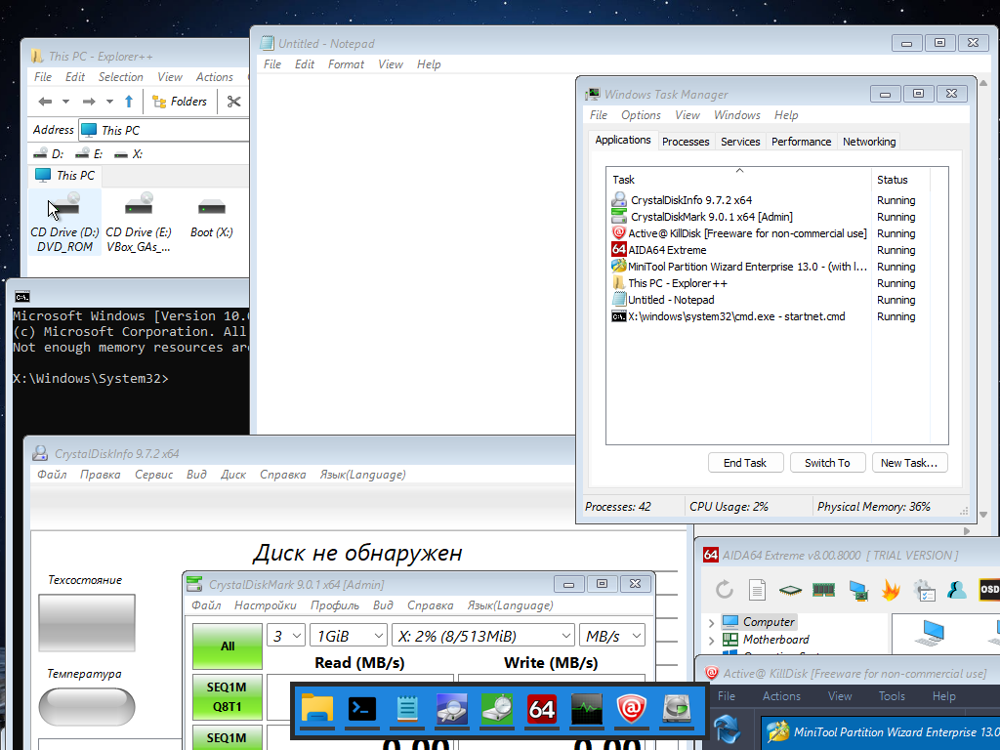

# VladWinPE - sysadmin's assistant for all occasions
Meet the lightest WinPE that will fit on any USB stick!

Image size: 655 MB. 
## A set of portable programs (downloaded from official websites):
- AIDA 64 EXTREME
- CrystalDiskInfo
- CrystalDiskMark
- Explorer++
- Active@ KillDisk
- MiniTool Partition Wizard
- Windows Cmd
- Windows Notepad
- Windows Task Manager
- PortableTaskbar (designed specifically for VladWinPE)

The author of VladWinPE is not responsible for any consequences from the use of this development. All software is provided in an unchanged form and in compliance with the copyrights of its copyright holders.

## How to create a bootable USB flash drive
Just [download](https://github.com/VladislavBanitsky/VladWinPE/releases/tag/v.1.0) the image and create a flash drive using any program convenient for you, such as Rufus or Ventoy, and enjoy the ease, portability and convenience!
## How to build and customize
1. Install the [Windows ADK and the Windows PE add-on](https://learn.microsoft.com/en-us/windows-hardware/get-started/adk-install)
2. Open Windows SDK terminal and execute the following commands:

`copype amd64 D:\VladPE_2025`

`Dism /Mount-Image /ImageFile:"D:\VladPE_2025\media\sources\boot.wim" /index:1 /MountDir:"D:\VladPE_2025\mount"`

`Dism /Add-Package /Image:"D:\VladPE_2025\mount" /PackagePath:"D:\Windows Kits\10\Assessment and Deployment Kit\Windows Preinstallation Environment\amd64\WinPE_OCs\WinPE-Scripting.cab"`

`Dism /Add-Package /Image:"D:\VladPE_2025\mount" /PackagePath:"D:\Windows Kits\10\Assessment and Deployment Kit\Windows Preinstallation Environment\amd64\WinPE_OCs\WinPE-WMI.cab"`

`Dism /Add-Package /Image:"D:\VladPE_2025\mount" /PackagePath:"D:\Windows Kits\10\Assessment and Deployment Kit\Windows Preinstallation Environment\amd64\WinPE_OCs\WinPE-NetFX.cab"`

`Dism /Add-Package /Image:"D:\VladPE_2025\mount" /PackagePath:"D:\Windows Kits\10\Assessment and Deployment Kit\Windows Preinstallation Environment\amd64\WinPE_OCs\WinPE-SecureStartup.cab"`

`Dism /Add-Package /Image:"D:\VladPE_2025\mount" /PackagePath:"D:\Windows Kits\10\Assessment and Deployment Kit\Windows Preinstallation Environment\amd64\WinPE_OCs\WinPE-EnhancedStorage.cab"`

`Dism /Add-Package /Image:"D:\VladPE_2025\mount" /PackagePath:"D:\Windows Kits\10\Assessment and Deployment Kit\Windows Preinstallation Environment\amd64\WinPE_OCs\WinPE-StorageWMI.cab"`

`Dism /Add-Package /Image:"D:\VladPE_2025\mount" /PackagePath:"D:\Windows Kits\10\Assessment and Deployment Kit\Windows Preinstallation Environment\amd64\WinPE_OCs\WinPE-DismCmdlets.cab"`

3. Download your favourite apps as portable, then create folders for each of them in folder `!portableApps`, also download icons (recommended 256x256px) and save them into the folder `icons` (in folder `!portableApps`). Then edit `default_config` JSON-variable in file `script.py`: enter correct paths to apps and icons

4. Create exe-file by pyintsaller from script.py and folder `!portableApps` with apps and icons added on previous step:
`pyinstaller "D:/Program_files/JetBrains/VladWinPE/script.py" --name "PortableTaskbar" --windowed --add-data "D:/Program_files/JetBrains/VladWinPE/!portableApps/*;."`

5. Put in folder `_internal` with portable apps and icons and `PortableTaskbar.exe` created by pyinstaller on previous step into the folder `Windows` in path `D:\VladPE_2025\mount\Windows`

6. Automatic startup `PortableTaskbar.exe` is already registered in `startnet.cmd`. You can add also special what do you want

7. Replace files `winpe.jpg` and `startnet.cmd` in the folder `D:/VladPE_2025/mount/Windows/System32`. You may need to change the file permissions in their properties

8. Save changes and unmount the image by entering the commands:

`Dism /Unmount-Image /MountDir:"D:\VladPE_2025\mount" /commit`

`MakeWinPEMedia /ISO D:\VladPE_2025 D:\VladWinPE_2025.iso`

